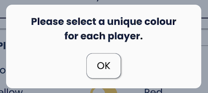

# CONNECT 4

_CONNECT 4_ is a website hosting a game called [Connect Four](https://en.wikipedia.org/wiki/Connect_Four)*. The site will be targeted towards people who want to play a quick and fun game regardless of their age. The site can be used for adults to have a short getaway and for children to learn the rules. The main goal of this project is to implement my JavaScript knowledge in a real-world context.

*Connect Four is a classic two-player strategy game, in which players take turns to drop their coloured disc into a 6-row by 7-column grid until one of the players forms a line of 4 discs horizontally, vertically or diagonally.

### View the live project [here](https://sejungkwak.github.io/connect-4/)

 

# Table of Contents

[User Experience (UX)](#user-experience-ux)
  - [User Stories](#user-stories)
  - [Design](#design)
  - [Wireframes / Mockups](#wireframes--mockups)
  - [Flowchart](#flowchart)

[Features](#features)
  - [Implemented Features](#implemented-features)
  - [Features Left to Implement](#features-left-to-implement)

[Technologies Used](#technologies-used)
  - [Languages](#languages)
  - [Library](#library)
  - [Programs](#programs)

 

# User Experience (UX)

## User Stories

- As a First Time Visitor,
  - I want to know how to play the game, so that I can enjoy it fully.
  - I want to know clearly when it is my turn, so that I don't delay the game.
  - I want to see the game board screen again when the game is over, so that I can figure out why I've won or lost.

 

- As a Returning Visitor,
  - I want to be able to play the game on my phone, so that I can play it on a break at work.
  - I want to play the game with my kids, so that we can have fun together.
  - I want to play the game against a computer, so that I can play practice games.

 

- As a Frequent User,
  - I want to be able to check my rank, so that I can see how good I am.
  - I want to be able to contact the developer, so that I can suggest my ideas.
  - I want to play the game against other players online, so that I can experience different play styles.

 

## Design

- Colour Scheme

  The best-known version of the physical game set which has been produced by [Hasbro](https://shop.hasbro.com/en-us/product/connect-4-game:80FB5BCA-5056-9047-F5F4-5EB5DF88DAF4) uses 3 colours: blue for the grid, yellow and red for discs. I have followed this colour convention with my own interpretation using [Canva](https://www.canva.com/) > Create a design > Logo > Styles and the colour picker.

  

- Typography

  - Headings: [Fredoka One](https://fonts.google.com/specimen/Fredoka+One) is used with Cursive as the fallback font in case the font isn't being imported into the site correctly. I have chosen Fredoka One for its big, bold and rounded shape which gives a soft feeling and adds a little fun to headings.

  - Paragraph: [Poppins](https://fonts.google.com/specimen/Poppins) is used with Sans Serif as the fallback font. I have chosen Poppins for readability and its sharp corners as opposed to Fredoka One.

- Logo

  The logo has the website name _CONNECT 4_ with the number 4 in a yellow colour on a red background circle which are the main colours of the game.

  

- Favicon

  The number 4 in a yellow colour on a red background circle in the same style as the logo.

  

 

## Wireframes / Mockups

- _CONNECT 4_ is designed with the following goals in mind:
	- A user can navigate to other pages while playing a game, and resume the game without having to restart.
	- A user can start a game with as few clicks as possible.
- To achieve these goals:
	- It is written in a single HTML file.
  - Each section is shown one at a time. This provides the user with the experience of separate pages for each section while ensuring the browser does not need to reload the page.
	- The __New game__ page is on the landing screen.
- I created wireframes and mockups for mobile and desktop.
- [View Wireframes and Mockups](documentation/DESIGN.md)

 

## Flowchart

I created a flowchart to visualise the process before writing JavaScript code.

[Back To **Table of Contents**](#table-of-contents)

 

# Features

## Implemented Features
The site features a fully responsive design and contains 4 game related pages(__New game__, __Play__, __Help__, __Leaderboard__), 3 supporting pages(__Contact__, __Success__, __Fail__) and a 404 page. The header and footer are identical for all pages except the 404 page.

- Header

  

  - The header is fixed to the top of the screen even when the user is scrolling down the page to allow easier navigation.
  - The logo is linked to the __New Game__ page and each menu item(New game, Play, Help, Leaderboard) is linked to each page respectively to allow easier navigation.
  - The navigation menu item for the current page is highlighted and underlined as the user browses the site for ease of use.
  - The navigation menu collapses on small devices less than 600px width to optimise the menu for smaller screen sizes.

    

- Footer

  

  - The footer includes the two following links

    - A link to the project's [_GitHub_ repository](https://github.com/sejungkwak/connect-4) to allow the users to learn more about this project.
    - A link to the __Contact__ page to allow the users to send a message to me directly from the site.
  
  - The external link opens in a new tab to allow the user to return to _Connect 4_ more easily.

- __New Game__ page

  

  - Upon landing _Connect 4_, this page is displayed for quick access to the game.
  - The form allows users to change the game settings.
  - Feedback is provided when the user changes to an invalid option. Both players must have a unique colour/name and at least one human player is required.

    | Invalid option | 2 computer players | Same colour | Same name |
    | :-------------: | :-------------: | :---------: | :-----------: |
    |  |  |  |  |

  - This page provides two buttons that open the __Play__ page.

    - __START__: The user can start a new game.
    - __CLOSE__: The user can resume the game they are playing.

- __Play__ page

  

  - This page displays the current player in the heading, allowing the user to make a move promptly.
  - There are sound effects when a disc is being placed and a game ends for a more enjoyable experience.
  - The user can turn on and off the sound as they prefer.
  - The first character of the disc colour is inside all placed discs for the colour blind users.
  - The game board is being adjusted to the screen size.
  - The user can play the game with arrow keys to allow the user to control depending on their preference.
  - If the user hasn't started a game and opens this page, the message displays instead of the game board to let the user know how to start a game.

    

  - The display mode alert is displayed when the whole game board is not shown on the screen. However, if the player still wants to play in landscape mode, they can press the __OK__ button and continue to play.

    

- __Help__ page

  

  - This page contains 5 articles about the game objective, how to play, keyboard controls, points system and leaderboard to help users understand the game and the site specific rules.
  - Less than 1024px width devices show each article in a single column to optimise the layout.

- __Leaderboard__ page

  

  - This page displays the top 5 players who gained the highest points with the number of games they played and the winning rate to allow them to see their performance.
  - The user can delete data from local storage with the convenient __Delete data__ button.
  - The message is shown when there is no data to display or unable to get the data from local storage.

    

- __Contact__ page

  

  - This page contains brief information about me and the contact form.

    - Information about me

      - This part lets the users know about me to make them more comfortable and more likely to provide their feedback.

    - Contact form

      - This form allows the user to send their message without having to open their email client.
      - All the fields are required and give feedback if empty(including whitespace) or invalid.
      - Upon clicking the __Send__ button, the user is redirected to either the __Success__ page or the __Fail__ page.
      - Less than 1024px width devices show each article in a single column to optimise the layout.

- __Success__ page

  

  - This page gives feedback to the user when their message has been sent successfully.
  - It includes a button to the Home page for quick access.

- __Fail__ page

  

  - This page gives feedback to the user when there was a problem delivering their message.
  - It includes a button to go back to the __Contact__ page.

- 404 page

  

  - This page gives feedback to the user when they try to access nonexistent pages on the site.
  - The blinking animation is disabled for any user with reduced motion enabled in their preferences on their device.
  - It includes a button to the Home page for quick access.
  - [View 404 page](https://sejungkwak.github.io/connect-4/404.html)

 

## Features Left to Implement

- Smarter AI Player

  The computer player picks a cell to place a disc randomly, so a game against the computer is too easy. I would like to build a smarter AI that prevents the player from winning so easily for a more enjoyable game.
  There is Pascal Pons’s [tutorial blog](http://blog.gamesolver.org/) about the connect 4 solver using alpha-beta pruning algorithm. Unfortunately, I was not able to fully understand the algorithm in depth to implement it into this project.

- Online live game platform

  Users can currently play on one device and cannot play against another player remotely. I would like to implement an online live game platform when I am confident in building a back-end.

- Database

  When an online live game platform is available, it is more appropriate to use an online database to show all the players from the site in a single leaderboard.

[Back To **Table of Contents**](#table-of-contents)

 

# Technologies Used

## Languages

- [HTML5](https://en.wikipedia.org/wiki/HTML5) was used to present and structure content.
- [CSS3](https://en.wikipedia.org/wiki/CSS) was used to style content.
- [JavaScript](https://en.wikipedia.org/wiki/JavaScript) was used to create dynamic and interactive content.

 

## Library

- [Emailjs](https://www.emailjs.com/) was used to receive the customised contact form directly from users.

 

## Programs

- [Am I Responsive](http://ami.responsivedesign.is/) was used to create the image showing a responsive design for the README.
- [Awesome Screenshot and Screen Recorder](https://chrome.google.com/webstore/detail/awesome-screenshot-and-sc/nlipoenfbbikpbjkfpfillcgkoblgpmj) was used to take the screenshots of the entire page for the README.
- [Balsamiq](https://balsamiq.com/) was used to create the wireframes.
- [BrowserStack](https://live.browserstack.com/dashboard#os=iOS&os_version=12.0&device_browser=safari&zoom_to_fit=true&full_screen=true&url=https%3A%2F%2Fsejungkwak.github.io%2Fconnect-4%2F&speed=1) was used to test the site on different devices/browsers.
- [Can I use](https://caniuse.com/) was used to check browser compatibility.
- [Canva](https://www.canva.com/en_gb/) was used to create the logo and favicon.
- [Chrome DevTools](https://developer.chrome.com/docs/devtools/) was used to view the site's styling and to debug during development and to check runtime performance.
- [Diagrams.net](https://app.diagrams.net/) was used to create the flowchart.
- [Eightshapes](https://contrast-grid.eightshapes.com/?version=1.1.0&background-colors=&foreground-colors=%231C304A%0D%0A%23DE0F3F%0D%0A%23FFC736%0D%0A%23FAFAFA&es-color-form__tile-size=regular&es-color-form__show-contrast=aaa&es-color-form__show-contrast=aa&es-color-form__show-contrast=aa18) was used to check the colour combination for the accessibility purpose.
- [Favicon.io](https://favicon.io/) was used to create the favicon.
- [Figma](https://www.figma.com/) was used to create the mockups.
- [Font Awesome](https://fontawesome.com/) was used for the responsive hamburger menu icons as well as the _GitHub_ and envelope icon in the footer. Each icon file was downloaded and converted to the svg path using VS Code.
- [GIPHY](https://giphy.com/) was used to convert video files to gifs for the README.
- [Git](https://git-scm.com/) was used for version control.
- [GitHub](https://github.com/) was used to store and deploy the project's code.
- [Gitpod](https://www.gitpod.io/) was used to develop and test my code.
- [Google Fonts](https://fonts.google.com/) was used to import Fredoka One and Poppins into the style.css file.
- [JSHint](https://jshint.com/) was used to check the JavaScript validity.
- [Regex101](https://regex101.com/) was used to create a regular expression to remove whitespace inside a string for the contact form.
- [Visual Studio Code](https://code.visualstudio.com/) was used to edit my code and create svg paths from svg image files.
- [W3C CSS Validation Service](https://jigsaw.w3.org/css-validator/) was used to check the CSS validity.
- [W3C Markup Validation Service](https://validator.w3.org/) was used to check the HTML markup validity.
- [WAVE](https://wave.webaim.org/) was used to evaluate the accessibility.

[Back To **Table of Contents**](#table-of-contents)

 
