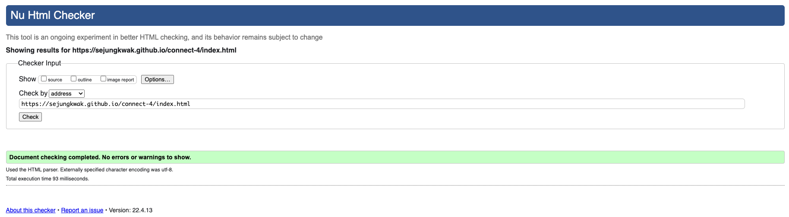
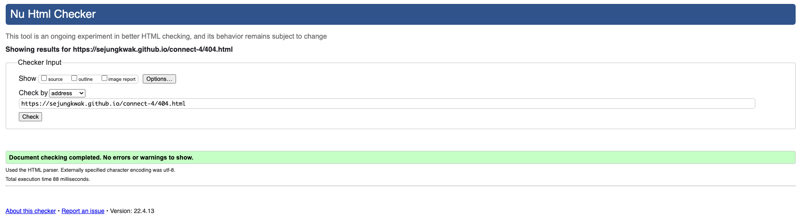
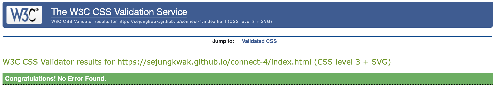
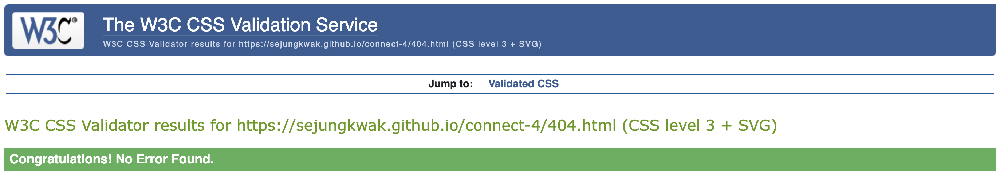
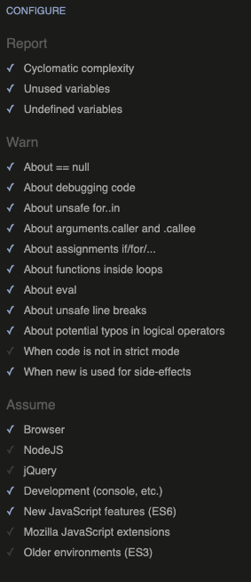
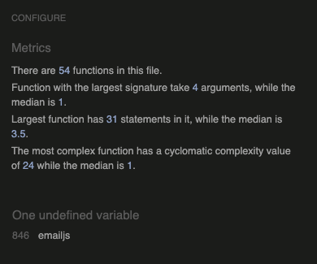
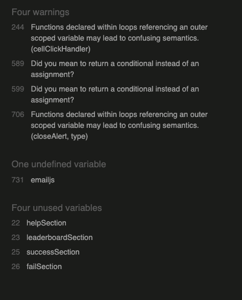

# Table of Contents

- [HTML Validation](#html-validation)
  - New game / Play / Help / Leaderboard page
  - 404 page

- [CSS Validation](#css-validation)
  - New game / Play / Help / Leaderboard page
  - 404 page
  - Previous Warnings

- [JS Validation](#js-validation)
  - JSHint Configuration
  - Code Validation
  - Previous Warnings

 

# HTML Validation

## New game / Play / Help / Leaderboard page

## 404 page

[Back To **Table of Contents**](#table-of-contents)

 

# CSS Validation

## New game / Play / Help / Leaderboard page

## 404 page

## Previous Warnings

- All the warnings have been resolved.

  - Warning message: `Imported style sheets are not checked in direct input and file upload modes`

    The Google font import URL is at line 2 and I validated the code by direct input. This warning is not present when validating by URI.

  - Warning message: `Same color for background-color and color`

    I used the same colour between the background and foreground for the blinking effect on the 404 page. However, I modified the code to get rid of the warning.

    - Code changes: I removed the `background-color` property at 0% and the `color` property at 20%, 21%, 50% and 70%. And I created 2 more stops at 1% and 69% and added the `background-color` and the `color` to the stop respectively.
  
    - [View commit details](https://github.com/sejungkwak/connect-4/commit/a4d6b7173e372bcc0b1b1ae7dc39f7b7d771dec1)

[Back To **Table of Contents**](#table-of-contents)

 

# JS Validation

## JSHint Configuration

I chose the options shown in the below image and added `/* jshint esversion: 8 */` at the top of the code when I ran it through JSHint.

## Code Validation

- Remaining warning

  - Message: `One undefined variable`

    - `emailjs` method is called at line 970* and this is not a variable that I can define in my custom JS file because EmailJS is an email API library and its CDN is linked to the index.html file at line 295 right above the custom JS file link.

      *JSHint validation report shows this is at line 971 because I added `/* jshint esversion: 8 */` at the top of the code.

## Previous Warnings

- Warnings below have been resolved.

  - Warning message: `Functions declared within loops ...`

    - Code changes: I took out the functions that were inside the `for` loops.
    
    - [View commit details](https://github.com/sejungkwak/connect-4/commit/65a03d40cb450d66847017028dc4a3029b04d923)
  
  - Warning message: `Did you mean to return a conditional instead of an assignment?`

    - Code changes: I simplified the line where the `return` statement was.
    
    - [View commit details](https://github.com/sejungkwak/connect-4/commit/43d985bb36999c49d3a61bb6c4dba12e57988c6f)
  
  - Warning message: `Four unused variables`

    - Code changes: I deleted those unused variables.
    
    - [View commit details](https://github.com/sejungkwak/connect-4/commit/f4b95a87a21d1d2ea179a11fbf755fe8d100f249)

[Back To **Table of Contents**](#table-of-contents)